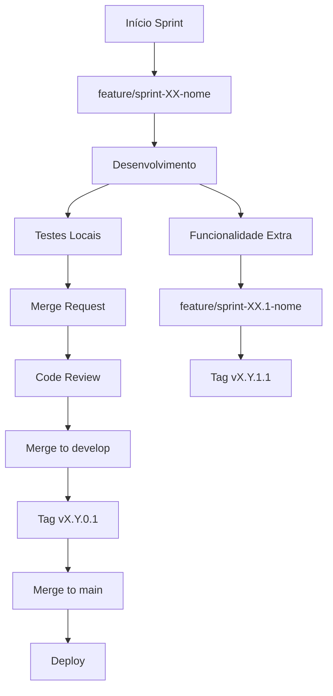

# 🤖 REGRAS DE DESENVOLVIMENTO - AI ASSISTANT

## 📋 **REGRA PRINCIPAL - SEMPRE CRIAR SPRINTS**

### 🎯 Para TODA solicitação de desenvolvimento:
1. **ANTES** de implementar qualquer código
   **VERIFICAR** Duplicidade de informação
2. **CRIAR** sprint detalhado usando template
3. **DOCUMENTAR** objetivos, arquivos, critérios
4. **ATUALIZAR** sprint conforme implementação real
5. **REGISTRAR** mudanças de estratégia imediatamente

---

## 🎨 **REGRAS OBRIGATÓRIAS - CONDENSAR E CONTRASTE**

### 📏 **CONDENSAR - SEMPRE APLICAR:**
```css
/* Design Tokens Obrigatórios */
--card-padding: 0.75rem;              /* Desktop */
--card-padding-mobile: 1rem;          /* Mobile touch-safe */
--gap-condensed: 0.5rem;              /* Entre elementos */
--table-cell: 0.5rem 0.75rem;        /* Células de tabela */
--space-y-sections: 1rem;            /* Entre seções */
```

### 🎨 **CONTRASTE - SEMPRE APLICAR:**
```css
/* Bordas e Sombras Obrigatórias */
--border-emphasis: 2px solid #d1d5db; /* Bordas contrastadas */
--shadow-card: shadow-md;             /* Sombras definidas */
--font-title: 700;                    /* Títulos bold */
--font-subtitle: 600;                 /* Subtítulos semibold */
```

### 🚨 **PADRÕES OBRIGATÓRIOS EM TODO CÓDIGO:**

#### **Cards:**
```tsx
// ✅ CORRETO - SEMPRE USAR
<Card className="border-2 border-gray-300 shadow-md">
  <CardHeader className="p-3 lg:p-3 pb-2">
    <CardTitle className="text-lg font-bold text-gray-900">
  <CardContent className="p-3 lg:p-3 pt-0 space-y-2">

// ❌ PROIBIDO
<Card className="border shadow-sm">
  <CardHeader className="p-6">
    <CardTitle className="text-2xl font-semibold">
```

#### **Tabelas:**
```tsx
// ✅ CORRETO - SEMPRE USAR
<TableCell className="px-3 py-2">
<TableHead className="h-10 px-3 py-2 font-bold text-gray-900">

// ❌ PROIBIDO  
<TableCell className="p-4">
<TableHead className="h-12 px-4 font-medium">
```

#### **Espaçamentos:**
```tsx
// ✅ CORRETO - DENSIDADE OTIMIZADA
<div className="space-y-2 lg:space-y-3">
<div className="grid gap-2 lg:gap-3">

// ❌ PROIBIDO - DESPERDÍCIO DE ESPAÇO
<div className="space-y-6">
<div className="grid gap-4 lg:gap-6">
```

#### **Badges:**
```tsx
// ✅ CORRETO - CONTRASTE DEFINIDO
<Badge className="border-2 border-green-300 bg-green-100 text-green-800 font-bold">

// ❌ PROIBIDO - SEM CONTRASTE
<Badge variant="secondary">
```

---

## 📝 **ESTRUTURA OBRIGATÓRIA DE SPRINT**

### 📊 Elementos Essenciais:
- **Resumo Executivo** - O que será feito
- **Objetivos Claros** - Principais e secundários
- **Arquivos Afetados** - Criar/Modificar/Remover
- **Critérios de Aceite** - Como validar sucesso
- **Aspectos Técnicos** - Tecnologias e estruturas
- **Responsividade** - Mobile-first obrigatório
- **Condensar e Contraste** - Aplicação obrigatória
- **Mudanças de Estratégia** - Se houver, documentar

### 🔄 Atualizações Durante Implementação:
- Mudanças de estratégia **IMEDIATAMENTE**
- Problemas técnicos encontrados
- Soluções implementadas
- Decisões técnicas importantes

---

## 🎨 **PADRÕES DE DESENVOLVIMENTO**

### 📱 Frontend - Regras Técnicas:
1. **Mobile-First SEMPRE**
   - Testar em mobile primeiro
   - Layout responsivo obrigatório
   - Touch interactions consideradas

2. **Design Tokens OBRIGATÓRIOS**
   - Importar `@import './styles/design-tokens.css'`
   - Usar variáveis CSS definidas
   - Seguir densidade condensada

3. **Componentes Reutilizáveis**
   - Usar shadcn/ui sempre que possível
   - Aplicar bordas e sombras contrastadas
   - Props bem tipadas com TypeScript

4. **Estados e Navegação**
   - Hooks para gerenciamento de estado
   - React Router para navegação
   - Estados centralizados por página/contexto

5. **Validações e UX**
   - Validações em tempo real
   - Feedback visual imediato
   - Loading states e error handling

### 🗂️ Estrutura de Arquivos:
```
src/
├── components/
│   ├── [modulo]/          # Componentes específicos
│   └── ui/                # Componentes base shadcn
├── pages/                 # Páginas/rotas principais
├── hooks/                 # Hooks customizados
├── types/                 # Definições TypeScript
├── data/                  # Dados mockados
├── styles/                # Design tokens e CSS
└── lib/                   # Utilitários
```

---

## 🔄 **GESTÃO DE MUDANÇAS**

### ⚠️ Quando Mudanças Acontecem:
1. **Documentar IMEDIATAMENTE** no sprint atual
   **Verificar Duplicidade de informção**
2. **Explicar justificativa** da mudança
3. **Comparar** estratégia inicial vs final
4. **Atualizar critérios** de aceite se necessário

### 📝 Formato de Documentação:
```markdown
### X️⃣ **[Nome da Mudança]**
**Justificativa:** [Por que foi necessário]
- ❌ Estratégia inicial: [O que estava planejado]
- ✅ Nova estratégia: [O que foi implementado]
- 🎯 Resultado: [Benefícios obtidos]
```

---

## 🧪 **VALIDAÇÃO E TESTES**

### ✅ Checklist Obrigatório ANTES de Finalizar:
- [ ] **Responsividade** testada (mobile/tablet/desktop)
- [ ] **Design Tokens** aplicados (condensar + contraste)
- [ ] **Bordas contrastadas** em todos cards (border-2 border-gray-300)
- [ ] **Sombras definidas** (shadow-md) em componentes elevados
- [ ] **Densidade otimizada** (40% mais informação por tela)
- [ ] **Navegação** funcionando corretamente
- [ ] **Estados de erro** tratados
- [ ] **Performance** otimizada
- [ ] **TypeScript** sem erros
- [ ] **UX/UI** seguindo padrões do projeto

### 🔍 Testes Específicos:
- Testar com dados reais dos mockados
- Validar todos os fluxos de navegação
- Verificar estados de loading/erro/sucesso
- Confirmar responsividade em diferentes tamanhos
- **Validar densidade:** Mais informação visível por tela

---

## 📊 **ESTRATÉGIAS COMPROVADAS**

### ✅ **Formulários Complexos:**
- **Páginas dedicadas** > Modals
- Validações em tempo real
- Seções expansíveis para organização
- Breadcrumb navigation
- **Padding condensado:** p-3 lg:p-3

### ✅ **Visualização de Dados:**
- **Sidebar** para detalhes rápidos
- **Páginas completas** para edição
- Navegação híbrida conforme contexto
- Dados sensíveis discretos mas acessíveis
- **Densidade otimizada:** space-y-2

### ✅ **Listagens e Filtros:**
- Busca em tempo real
- Filtros avançados expansíveis
- Contadores e estatísticas
- Ações contextuais por item
- **Tabelas densas:** px-3 py-2

### ✅ **Cards e Componentes:**
- **Bordas contrastadas:** border-2 border-gray-300
- **Sombras definidas:** shadow-md
- **Títulos bold:** font-bold text-gray-900
- **Badges contrastados:** border-2 com cores saturadas

---

## 🚨 **PROBLEMAS COMUNS A EVITAR**

### ❌ **Design Tokens Não Aplicados:**
- SEMPRE importar design-tokens.css
- Não usar padding/margin aleatórios
- Seguir densidade responsiva (mobile/desktop)

### ❌ **Contraste Insuficiente:**
- Bordas border-2 obrigatórias em cards
- Sombras shadow-md em componentes elevados
- Font weights definidos (bold/semibold/medium)

### ❌ **Densidade Perdida:**
- Espaçamentos grandes (space-y-6 proibido)
- Padding excessivo (p-6 proibido)
- Gaps grandes (gap-4 lg:gap-6 proibido)

### ❌ **Incompatibilidade de Dados:**
- SEMPRE verificar estrutura real dos mockados
- Não assumir campos que podem não existir
- Testar com dados reais antes de finalizar

### ❌ **Estados Indefinidos:**
- Tratar casos de loading
- Prever estados de erro
- Definir comportamento para dados vazios

### ❌ **Navegação Inconsistente:**
- Manter padrões de navegação
- Botões de voltar/cancelar sempre presentes
- URLs amigáveis e consistentes

### ❌ **Documentação Desatualizada:**
- Sprints devem refletir implementação REAL
- Não deixar documentação defasada
- Atualizar imediatamente após mudanças

---

## 🎯 **FLUXO DE TRABALHO IDEAL**

### 1️⃣ **Recebimento da Solicitação**
- Analisar requisitos
- Identificar módulos/arquivos afetados
- Criar sprint usando template
- **Planejar aplicação de condensar+contraste**

### 2️⃣ **Planejamento**
- Definir estratégia inicial
- Listar arquivos a criar/modificar
- Estabelecer critérios de aceite
- **Definir densidade e contraste desejados**

### 3️⃣ **Implementação**
- Seguir padrões estabelecidos
- **Aplicar design tokens obrigatórios**
- **Implementar bordas e sombras contrastadas**
- Documentar mudanças em tempo real
- Testar continuamente

### 4️⃣ **Validação**
- Checklist obrigatório completo
- **Verificar densidade (40% mais informação)**
- **Validar contraste (WCAG AA)**
- Testes de responsividade
- Validação com dados reais

### 5️⃣ **Finalização**
- Atualizar sprint com implementação real
- Documentar lições aprendidas
- Preparar próximos passos

---

## 📚 **REFERÊNCIAS INTERNAS**

### 📁 **Arquivos de Referência:**
- `src/styles/design-tokens.css` - **OBRIGATÓRIO em todo projeto**
- `docs/sprint/TEMPLATE-SPRINT.md` - Template padrão
- `docs/sprint/sprint-06-design-system-otimizado.md` - Implementação de referência
- `docs/regras-desenvolvimento.md` - Regras técnicas do projeto
- `src/types/` - Estruturas de dados definidas

### 🎨 **Padrões UX/UI:**
- **Mobile-first** obrigatório
- **shadcn/ui** como base + design tokens
- **Cores semânticas** para status (saturadas)
- **Layouts condensados** e intuitivos
- **Bordas contrastadas** em todos componentes
- **Densidade 40% maior** que padrões comuns

---

## 🔄 **VERSIONAMENTO DESTA REGRA**

**Versão:** 2.0  
**Criada:** Janeiro 2025  
**Atualizada:** Janeiro 2025 (Sprint 07)  
**Baseada em:** Lições da Sprint 05 + Sprint 06 + Sprint 07  
**Próxima Revisão:** Após Sprint 08  

### 📈 **Atualizações v2.0:**
- ✅ **Design Tokens obrigatórios** em todo código
- ✅ **Condensar e Contraste** como padrão
- ✅ **Checklist expandido** com densidade e contraste
- ✅ **Exemplos práticos** de implementação
- ✅ **Problemas comuns** atualizados

#### ✅ **O QUE IMPLEMENTAR:**
- ✅ **Componentes UI** completos e funcionais
- ✅ **Layouts responsivos** com navegação
- ✅ **Demonstrações visuais** com dados simulados
- ✅ **Estados de interface** (loading, error, success)
- ✅ **Formulários com validação** (client-side)
- ✅ **Navegação entre páginas** (React Router)
- ✅ **Sistema i18n** completo
- ✅ **Responsividade** total
- ✅ **Acessibilidade** nativa

### 🎯 **METAS OBRIGATÓRIAS**

#### **Por Sprint:**
- ✅ **0 erros TypeScript** na compilação
- ✅ **0 warnings ESLint** no código
- ✅ **Build time < 5 segundos**
- ✅ **100% responsivo** (mobile + desktop)
- ✅ **Componentes documentados** com exemplos

### 📈 **MONITORAMENTO CONTÍNUO**

```
Métricas a acompanhar:
├── Bundle Size (< 2MB total)
├── Build Time (< 5 segundos)
├── TypeScript Coverage (100%)
├── Component Count (tracking)
├── Code Quality Score (A+)
└── Mobile Performance (90%+)
```

# 🏷️ CONTROLE DE VERSÃO

### 📊 **PADRÃO DE VERSIONAMENTO ADOTADO**

**Formato:** `MAJOR.MINOR.PATCH.BUILD`  
**Exemplo:** `v3.4.0.1`  
**Base:** Semantic Versioning (SemVer) + Build Number

```
v3.4.0.1
│ │ │ │
│ │ │ └── BUILD: Incremento automático/manual
│ │ └──── PATCH: Correções e melhorias menores
│ └────── MINOR: Novas funcionalidades compatíveis
└──────── MAJOR: Mudanças incompatíveis ou reestruturação
```

### 📋 **REGRAS DE INCREMENTO**

#### 🚨 **MAJOR (X.0.0.0) - Mudanças Incompatíveis**
**Quando incrementar:**
- Mudanças na arquitetura base do sistema
- Remoção de componentes ou funcionalidades existentes
- Refatoração completa que quebra compatibilidade
- Migração de tecnologia principal (React → Vue, etc.)
- Mudanças que exigem migração de dados

**Exemplos Práticos:**
```
v2.x.x.x → v3.0.0.1  ← Migração React + TypeScript + Vite
v3.x.x.x → v4.0.0.1  ← Mudança para Next.js ou Remix
v4.x.x.x → v5.0.0.1  ← Remoção de módulos antigos
```

#### ⭐ **MINOR (x.Y.0.0) - Novas Funcionalidades**
**Quando incrementar:**
- Nova sprint principal concluída
- Novo módulo/página adicionado ao sistema
- Novas funcionalidades significativas
- Componentes principais adicionados
- Integração de bibliotecas importantes

**Exemplos Práticos:**
```
v3.1.0.1 ← Sprint 01: Sistema de Agenda
v3.2.0.1 ← Sprint 02: Dashboard Principal  
v3.3.0.1 ← Sprint 03: Gestão de Tarefas
v3.4.0.1 ← Sprint 04: Gestão de Atividades
v3.5.0.1 ← Sprint 05: Gestão de Leads (futuro)
```

#### 🔧 **PATCH (x.y.Z.0) - Correções e Melhorias**
**Quando incrementar:**
- Funcionalidades adicionais dentro de uma sprint
- Correções de bugs não críticos
- Melhorias de performance menores
- Atualizações de dependências menores
- Refinamentos de UI/UX

**Exemplos Práticos:**
```
v3.3.1.1 ← Sprint 03.1: Cores Customizáveis
v3.3.2.1 ← Sprint 03.2: Filtros Avançados (se existisse)
v3.4.1.1 ← Correção de bug no sistema de atividades
v3.4.2.1 ← Melhoria na responsividade mobile
```

#### 🔨 **BUILD (x.y.z.B) - Builds e Deploys**
**Quando incrementar:**
- A cada build de desenvolvimento
- A cada deploy para ambiente
- Correções hotfix críticas
- Atualizações de configuração
- Rebuilds para otimização

**Exemplos Práticos:**
```
v3.4.0.1 ← Build inicial da versão
v3.4.0.2 ← Rebuild com otimizações
v3.4.0.3 ← Deploy para staging
v3.4.0.4 ← Hotfix crítico
```

### 🏷️ **SISTEMA DE TAGS GIT**

#### **Convenção de Tags:**
```bash
# Tags de versão principais
git tag -a v3.4.0.1 -m "Sprint 04 - Gestão de Atividades"

# Tags com detalhes
git tag -a v3.4.0.1 -m "
Sprint 04: Gestão de Atividades
- Sistema de boards colaborativos
- CRUD completo de atividades
- Integração com cores customizáveis
- 100% responsivo e funcional
"

# Push das tags
git push origin --tags
```

#### **Padrão de Mensagens:**
```bash
# Release Principal (MINOR)
v3.5.0.1 - "Sprint 05: Gestão de Leads"

# Funcionalidade Adicional (PATCH)  
v3.5.1.1 - "Sprint 05.1: Filtros Avançados de Leads"

# Correção (BUILD)
v3.5.1.2 - "Hotfix: Correção responsividade mobile"
```

### 🔄 **FLUXO DE VERSIONAMENTO CRM**

#### **Processo por Sprint:**



### 🚨 **REGRAS DE BRANCHES**

#### ✅ **PERMITIDO:**
- **Trabalhar no develop** para novas funcionalidades
- **Criar branches feature/** para sprints específicas
- **Merge de feature para develop** após code review
- **Deploy de develop para test** para validação
- **Merge de test para main** somente após QA aprovado

#### ❌ **PROIBIDO:**
- ❌ **Commits diretos na main** (somente via merge)
- ❌ **Push force** em qualquer branch compartilhado
- ❌ **Merge sem code review** (exceto pessoal)
- ❌ **Deploy de develop direto para main**
- ❌ **Deletar branches remotos** sem aprovação

---

**📌 LEMBRETE CONSTANTE:**
**TODA SOLICITAÇÃO = SPRINT PRIMEIRO + CONDENSAR + CONTRASTE SEMPRE** ✅

---

**📋 ESTAS REGRAS SÃO OBRIGATÓRIAS PARA TODAS AS SPRINTS**  
**🔄 ATUALIZAR ROADMAP.MD COMO ÚNICA FONTE DE VERDADE**  
**🧪 MANTER MODO MOCKUP ATÉ INTEGRAÇÃO BACKEND**  
**📊 DOCUMENTAÇÃO CENTRALIZADA E CONSISTENTE**  
**🏷️ VERSIONAMENTO RIGOROSO E PROFISSIONAL**

---